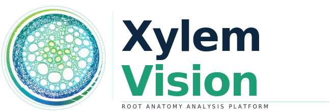
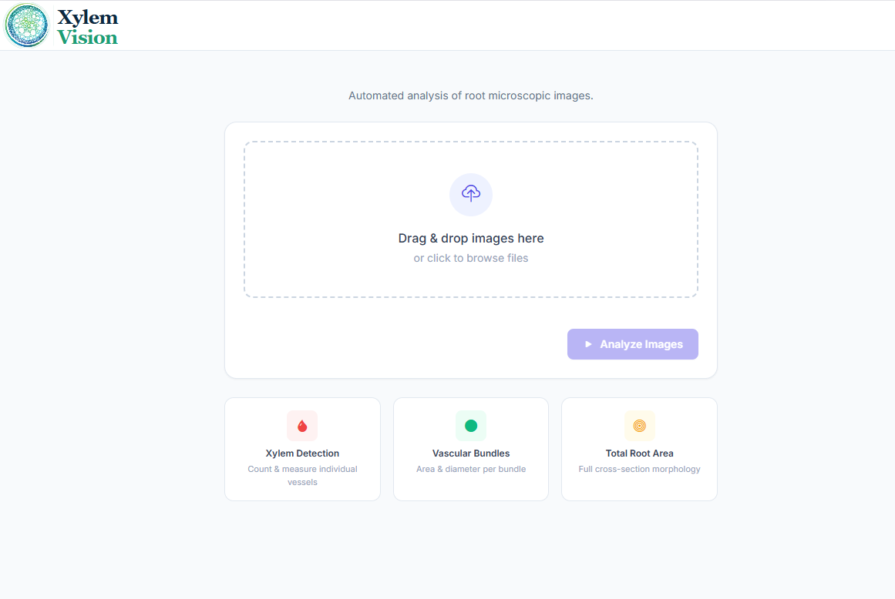

<p align="center">
  
</p>

# XylemVision
 
A Django web application for quantifying root anatomy from microscope cross-section images. Upload a root cross-section image and get automated detection and measurement of xylem vessels, vascular bundles, and total root area — with an interactive correction canvas and Excel export.



## Features

- Automated detection of xylem vessels, vascular bundles, and total root using YOLO + SAM
- Interactive annotation canvas — draw boxes, click points, or select masks to correct results
- Quantitative traits: count, area, diameter (calibrated in µm at 20× magnification)
- Excel report export
- Export corrected masks as training data (image + XML label)
- GPU and CPU builds supported

---

## Prerequisites

- [Docker](https://www.docker.com/products/docker-desktop/) installed and running
- NVIDIA GPU + driver 525+ (for GPU build only)
- ~20 GB free disk space (GPU) or ~8 GB (CPU)
- Internet connection on first build (downloads model weights automatically)

---

## Quick Start

### Clone the repo

```bash
git clone https://github.com/hasiburniloy/XylemVision.git
cd XylemVision
```

### GPU build (recommended if you have an NVIDIA GPU)

```bash
bash build.sh
```

### CPU build (no GPU required)

```bash
bash build.sh --cpu
```

**First build takes 15–30 minutes** it pulls the base image, installs all dependencies, and downloads the model weights (~2.5 GB SAM + ~60 MB YOLO).

Open the app at: **http://localhost:8000**

> **Windows users without Git Bash:** see [Manual Docker commands](#manual-docker-commands-windows) below.

---

## Windows — NVIDIA GPU Setup

If you have an NVIDIA GPU on Windows:

1. Install [Docker Desktop](https://www.docker.com/products/docker-desktop/) with WSL 2 backend
2. Install the [NVIDIA driver](https://www.nvidia.com/Download/index.aspx) (525+)
3. No NVIDIA Container Toolkit needed on Windows — Docker Desktop handles it automatically

Verify GPU access in Docker:
```bash
docker run --rm --gpus all nvidia/cuda:12.6.3-base-ubuntu22.04 nvidia-smi
```

---

## Linux — NVIDIA GPU Setup

```bash
# Install Docker
curl -fsSL https://get.docker.com | sh
sudo usermod -aG docker $USER && newgrp docker

# Install NVIDIA Container Toolkit
curl -fsSL https://nvidia.github.io/libnvidia-container/gpgkey \
  | sudo gpg --dearmor -o /usr/share/keyrings/nvidia-container-toolkit-keyring.gpg
curl -s -L https://nvidia.github.io/libnvidia-container/stable/deb/nvidia-container-toolkit.list \
  | sed 's#deb https://#deb [signed-by=/usr/share/keyrings/nvidia-container-toolkit-keyring.gpg] https://#g' \
  | sudo tee /etc/apt/sources.list.d/nvidia-container-toolkit.list
sudo apt-get update && sudo apt-get install -y nvidia-container-toolkit
sudo nvidia-ctk runtime configure --runtime=docker
sudo systemctl restart docker
```

---

---

## Hot-Updating Files (No Rebuild Needed)

After editing the UI template:
```bash
docker cp analysis/templates/upload.html xylemvision-app:/app/analysis/templates/upload.html
docker exec xylemvision-app kill -HUP 1
```

After editing Python files (`views.py`, `engine.py`, etc.):
```bash
docker cp analysis/views.py xylemvision-app:/app/analysis/views.py
docker exec xylemvision-app kill -HUP 1
```

---

## Updating the YOLO Model Weight

**Option A — Rebuild with new weight:**
1. Replace `weight/YOLO/best.pt` locally
2. Run `bash build.sh`

**Option B — Hot-swap without rebuild:**
```bash
docker cp weight/YOLO/best.pt xylemvision-app:/app/weight/YOLO/best.pt
docker restart xylemvision-app
```

**Option C — Change the Google Drive download link in the Dockerfile:**
Edit the `gdown` line (~line 37) in `Dockerfile` or `Dockerfile.cpu`:
```dockerfile
gdown https://drive.google.com/uc?id=<NEW_DRIVE_ID> -O /app/weight/YOLO/best.pt
```
Then rebuild.

---

## Manual Docker Commands (Windows)

If you cannot run `bash build.sh`, run these in PowerShell or Command Prompt:

**GPU:**
```powershell
docker stop xylemvision-app
docker rm xylemvision-app
docker rmi xylemvision
docker build -t xylemvision .
docker run --gpus all -p 8000:8000 --name xylemvision-app -d xylemvision
```

**CPU:**
```powershell
docker stop xylemvision-app
docker rm xylemvision-app
docker rmi xylemvision-cpu
docker build -f Dockerfile.cpu -t xylemvision-cpu .
docker run -p 8000:8000 --name xylemvision-app -d xylemvision-cpu
```

---

## Changing the Port

Edit `build.sh` and change `-p 8000:8000` to e.g. `-p 8080:8000`, then access at `http://localhost:8080`.

---

## Troubleshooting

| Problem | Fix |
|---|---|
| `could not select device driver "nvidia"` | NVIDIA Container Toolkit not installed / Docker not restarted. Re-run Linux GPU setup. |
| `nvidia-smi` fails inside container | Update NVIDIA driver to 525+. |
| Port 8000 already in use | Change port in `build.sh`: `-p 8080:8000` |
| `gdown` fails during build (quota exceeded) | Place weight files in `weight/` manually and update Dockerfile to use `COPY` instead of `gdown` |
| Page loads but upload does nothing | Open browser DevTools (F12 → Console) and check for JS errors |
| Analysis starts but never finishes | Check `docker logs -f xylemvision-app` for Python errors |
| SAM is slow on CPU | Expected — SAM ViT-L is a large model. Allow 1–3 min per image on CPU |
| `permission denied` on `build.sh` | Run `chmod +x build.sh` first |

---

## Project Structure

```
XylemVision/
├── Dockerfile              ← GPU build (CUDA 12.6 base)
├── Dockerfile.cpu          ← CPU-only build (Python slim base)
├── build.sh                ← Build + run script
├── requirements.txt        ← Python dependencies
├── manage.py               ← Django entry point
├── root/                   ← Django project settings
├── analysis/
│   ├── engine.py           ← YOLO + SAM inference pipeline
│   ├── views.py            ← API endpoints (analyze, SAM, reanalyze, export)
│   ├── urls.py             ← URL routing
│   ├── utils.py            ← Mask/contour helpers
│   ├── configs.py          ← Calibration constants (µm/pixel)
│   └── templates/
│       └── upload.html     ← Main UI (Fabric.js annotation canvas)
├── weight/                 ← Model weights (not in repo — downloaded on build)
│   ├── SAM/sam_vit_l_0b3195.pth
│   └── YOLO/best.pt
├── assets/                 ← Screenshots
└── Sample test/            ← Test images
```

---

## License

Apache 2.0 License — see [LICENSE](LICENSE).
